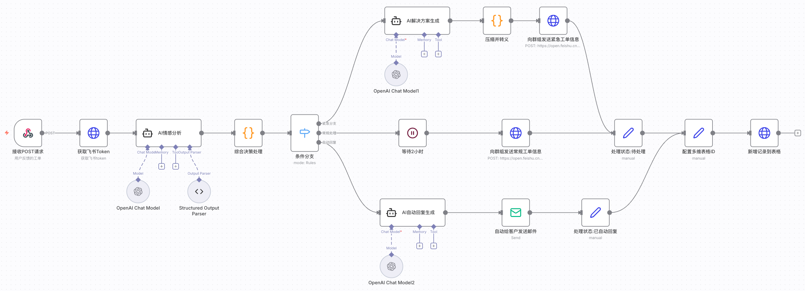

# n8n配置7x24小时无人值守工单分诊自动化工作流   

## 1、工作流说明

本期视频为大家分享的工作流是 **7x24小时无人值守工单分诊自动化工作流**      
核心是以一个实际的应用案例为大家分享如何在n8n中使用Webhook节点和Send Email节点           
工作流中还会涉及到之前为大家介绍过的AI Agent节点、Code节点、HTTP Request节点等     

工作流实现的业务逻辑如下工作流所示:              

         

## 2、前期准备工作

### 2.1 下载并安装Apifox工具  

Apifox工具用于Webhook节点调试，进行API接口的调用                                
直接进入官方网站 https://apifox.com/ 下载安装客户端软件即可               

安装完成后打开客户端软件，创建团队->进入团队，创建项目->导入本期视频需要使用的接口配置文件 n8n测试.apifox.json           

### 2.2 邮箱SMTP服务开启和配置

本期视频以网易邮箱为例，其他邮箱步骤类似            
首先，登陆到网易邮箱官网 https://email.163.com/ 进行注册并登陆(若已有账号直接登录)            
登陆到邮箱之后，点击“设置”->点击"POP3/SMTP/IMAP"->开启“POP3/SMTP服务”->开启后将生成的密码拷贝备用               

SMTP服务器地址:smtp.163.com            

### 2.3 飞书

本期视频会使用飞书的群组来进行工单信息的及时提醒和工单数据的存储(多维表格)        
首先，登陆到飞书官网 https://www.feishu.cn/ 注册并登陆            

本期视频会使用HTTP Request节点来调用飞书的消息服务和多维表格服务，若不清楚这两个服务如何在n8n中使用，建议你观看如下视频:              

03_【工作流】n8n配置飞书保姆级配置指南：HTTP Request节点 社区飞书节点 云空间 多维表格 群组即时消息 支持文本、图片、富文本、卡片、音视频、文件等                     
- 资料在项目内 workflows 文件夹中的 02_*** 文件夹，下载即可                                                                    
- YouTube频道对应视频: https://youtu.be/zhSKnqJa9to                                                            
- B站频道对应视频: https://www.bilibili.com/video/BV1aD2TBsEkZ/             

## 3、核心节点介绍

### 3.1 Webhook 节点
Webhook 节点是 n8n 实现与外部世界实时集成和自动化的核心组件之一，非常适合需要事件驱动自动化的场景        

Webhook 节点是 n8n 中的一个触发节点（Trigger Node），用于创建 Webhook          
当外部应用或服务发生事件时，可以通过 Webhook 将数据发送到 n8n，从而触发工作流的执行        
Webhook 节点非常适合用来接收外部系统的数据，实现自动化流程，尤其是在没有专用触发节点的情况下                

**主要功能和特点:**             

- **触发工作流:** Webhook 节点作为工作流的起点，监听外部 HTTP 请求（如 GET、POST、PUT、PATCH、DELETE 等），一旦收到请求就启动整个工作流          
- **测试与生产环境:** 每个 Webhook 节点会生成两个 URL，分别用于测试和生产。测试 URL 便于在编辑器中调试和查看数据，生产 URL 用于实际运行时触发工作流。测试 URL 有 120 秒的监听时长，生产 URL 需要激活工作流后才能使用，且不会在编辑器中显示实时数据，但可以在执行记录中查看            
- **自定义路径和参数:** 可以自定义 Webhook 的 URL 路径，包括动态参数，方便与外部系统集成              
- **支持多种认证方式:** 支持 Basic Auth、Header Auth、JWT Auth 或无认证，提升安全性           
- **响应模式灵活:** 可以选择立即响应、等待工作流最后一个节点完成后响应，或通过 Respond to Webhook 节点自定义响应内容，还支持流式响应Webhook 节点参数             
- **高级选项:** 如 CORS 设置、IP 白名单、忽略爬虫、接收二进制数据、设置自定义响应头等Webhook 节点选项                

**典型应用场景:**             

- 接收第三方服务的 Webhook 事件，自动处理数据             
- 搭建自定义 API 接口，外部系统通过 HTTP 请求触发 n8n 流程并获取处理结果         
- 实现自动化通知、数据同步、内容分发等多种自动化场景        

资料中提供了webhook常见3种应用场景测试工作流json文件                                    

### 3.2 Send Email 节点

Send Email 节点是 n8n 内置的核心节点之一，用于通过 SMTP 邮件服务器发送电子邮件          
它适用于大多数支持 SMTP 协议的邮箱服务（如 Gmail、Outlook、Yahoo、QQ、网易等），可以灵活配置发件人、收件人、主题、正文、附件等参数            

**主要功能和参数:**              

- **凭据（Credentials）:** 需要配置 SMTP 账号凭据，包括邮箱地址、密码（或应用专用密码）、SMTP 主机、端口等               
- **操作类型（Operation）:** Send：发送邮件;Send and Wait for Response：发送邮件并等待收件人回复等待响应说明             
- **发件人邮箱（From Email）:** 可填写邮箱地址，也可用“姓名 <邮箱地址>”格式                
- **收件人邮箱（To Email）:** 支持单个或多个收件人，多个邮箱用逗号分隔             
- **主题（Subject）:** 邮件主题              
- **邮件格式（Email Format）:** 可选择 Text（纯文本）、HTML 或 Both（两者都发送）          
- **附件（Attachments）:** 可通过二进制属性添加一个或多个附件              
- **抄送/密送（CC/BCC）:** 支持抄送和密送功能                
- **Reply To:** 设置回复邮箱               
- **附加选项:** 如是否附加 n8n 自动发送标识、忽略 SSL 问题等节点参数说明                   

**典型应用场景:**         

- 自动发送通知、报告、审批请求等邮件                
- 结合其他节点，实现自动化邮件回复、批量群发等            
- 支持审批流、表单收集等高级交互场景               

### 3.3 AI Agent 节点

AI Agent 节点是 n8n 中用于构建智能自动化流程的核心节点之一               
它代表了一个能够自主决策、调用外部工具和 API、并根据环境完成特定目标的智能体（Agent）            
与传统的 LLM（大语言模型）节点只负责文本生成不同，AI Agent 节点具备多步推理、工具调用和任务执行能力，适合处理更复杂的自动化场景            

**主要特点:**       

- **自主决策与多步推理:** AI Agent 节点可以根据输入内容，自动决定调用哪些工具（如数据库、API、Web Scraping 等），并多次循环执行，直到完成目标任务              
- **工具集成:** 必须至少连接一个工具子节点（如 HTTP 请求、数据库查询等），Agent 会根据任务自动选择合适的工具             
- **适用场景广泛:** 可用于构建聊天机器人、自动化数据分析、网页抓取、自动回复邮件等多种智能场景            
- **与 LLM 配合:** AI Agent 节点以 LLM 作为“推理引擎”，通过 prompt（提示词）与上下文信息驱动智能决策           
- **无需编码，低代码可视化配置:** 通过拖拽和参数配置即可实现复杂的智能体逻辑，适合开发者和业务人员快速搭建 AI 工作流             

**常见用法:**     

- 构建智能聊天机器人，自动理解用户意图并调用外部服务完成任务            
- 自动化数据处理、信息检索、内容生成等多步流程          
- 结合记忆管理节点，实现上下文连续的对话和任务处理AI Agentic 工作流介绍           
 
本期视频的工作流使用AI Agent节点会搭配LLM节点，LLM节点的配置涉及到第三方服务的凭证创建，这里使用的大模型代理平台                       
这里使用的大模型代理平台:https://nangeai.top/                  
关于大模型代理平台如何使用 大家参考这期视频 https://youtu.be/mTrgVllUl7Y                  

### 3.4 HTTP Request 节点

HTTP Request 节点是 n8n 中最强大、最通用的节点之一             
它允许你向任何支持 REST API 的应用或服务发起 HTTP 请求，实现数据的获取、发送或操作，非常适合对接没有专用 n8n 节点的第三方服务                

**主要功能与参数:**            

- **请求方法:** 支持 GET、POST、PUT、PATCH、DELETE、HEAD、OPTIONS 等常见 HTTP 方法，可满足绝大多数 API 场景需求                    
- **URL:** 填写目标 API 的接口地址                
- **认证方式:** 支持多种认证，包括预定义凭据（如已有的服务集成）、Basic Auth、Header Auth、Bearer Token、OAuth1、OAuth2 等。推荐优先使用预定义凭据，配置更简单             
- **请求头和参数:** 可自定义请求头（Headers）、查询参数（Query Parameters）、请求体（Body），支持表单、JSON、二进制等多种格式            
- **响应格式:** 可选择返回 JSON、字符串、二进制等格式，便于后续节点处理                    

**典型应用场景:**         

- 对接没有专用节点的第三方 API            
- 实现自定义数据抓取、推送、自动化操作            
- 结合其他节点，实现复杂的自动化业务流程           

本期视频会使用HTTP Request节点来调用飞书的消息服务和多维表格服务，若不清楚这两个服务如何在n8n中使用，建议你观看如下视频:              

03_【工作流】n8n配置飞书保姆级配置指南：HTTP Request节点 社区飞书节点 云空间 多维表格 群组即时消息 支持文本、图片、富文本、卡片、音视频、文件等                     
- 资料在项目内 workflows 文件夹中的 02_*** 文件夹，下载即可                                                                    
- YouTube频道对应视频: https://youtu.be/zhSKnqJa9to                                                            
- B站频道对应视频: https://www.bilibili.com/video/BV1aD2TBsEkZ/                       

### 3.5 Code节点

Code 节点是 n8n 中用于在工作流中编写和执行自定义代码的核心节点           
它支持 JavaScript 和（通过 Pyodide 的方式，有限支持）Python，可以灵活处理和转换数据，实现复杂的业务逻辑       

**主要特点:**            

- **支持语言:** 主要支持 JavaScript，部分版本支持 Python（基于 Pyodide，未来版本将不再支持 Python）              
- **两种执行模式:** Run Once for All Items：对所有输入数据一次性处理，适合需要聚合或整体处理的场景; Run Once for Each Item：对每个输入数据单独处理，适合逐条转换                        
- **内置方法与变量:** 可直接使用 n8n 提供的内置方法和变量，便于访问数据、环境信息等                  
- **外部库支持:** 自托管 n8n 可引入和使用 Node.js 内置模块及第三方 npm 包（需配置）。n8n Cloud 仅支持 crypto 和 moment 两个模块                
- **调试与开发体验:** 支持 console.log 输出调试信息，编辑器内有自动补全、多光标等              
- **数据结构要求:** 输出必须为数组格式，每个元素为包含 json 属性的对象，否则会报错               

**典型应用场景:**            

- 数据清洗、格式转换、聚合统计等               
- 复杂业务逻辑实现，如条件判断、批量处理等               
- 与其他节点配合，实现灵活的自动化流程               

## 4、API接口测试数据

**使用如下3个模拟工单请求数据进行测试:**                  

- 紧急处理:            
{          
    "source": "网站表单",         
    "customer_name": "南哥",           
    "customer_email": "test@example.com",          
    "issue_title": "支付问题",           
    "issue_description": "我支付成功了但是订单没有更新，这让我很着急！"              
}         

- 常规处理:         
{           
    "source": "网站表单",           
    "customer_name": "南哥",          
    "customer_email": "test@example.com",          
    "issue_title": "技术问题",          
    "issue_description": "发现状态更新不及时，不过这不是很重要。"            
}          

- 自动回复:            
{      
    "source": "网站表单",     
    "customer_name": "南哥",      
    "customer_email": "test@example.com",       
    "issue_title": "普通问题",       
    "issue_description": "如何进行支付。"         
}         

